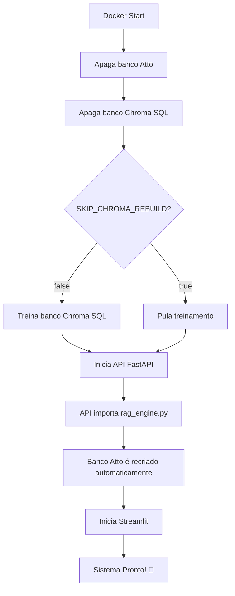

# 🚀 Guia Rápido - Sistema de Bancos RAG Automatizado

## ✅ O que foi implementado?

Agora quando você inicia o container Docker, **ambos os bancos vetoriais são automaticamente atualizados**:

1. **Banco Atto** → Apagado e recriado automaticamente pela API
2. **Banco Chroma SQL** → Apagado e retreinado via `train_vectorstore.py`

---

## 🎯 Uso Básico

### **1. Copie o docker-compose.example.yml**
```bash
cd HectorAI
cp docker-compose.example.yml docker-compose.yml
```

### **2. Configure seu .env**
Certifique-se de ter essas variáveis:
```bash
# OpenAI
OPENAI_API_KEY="sk-..."

# Oracle (necessário para treinar banco SQL)
USER="seu_usuario"
SENHA="sua_senha"
DSN="host:porta/servico"  # Se Oracle está em localhost, use: host.docker.internal:1521/XEPDB1
```

### **3. Inicie o sistema**
```bash
docker-compose up --build
```

### **4. Acompanhe os logs**
Você verá algo assim:
```
==========================================
🚀 Iniciando HectorAI com atualização dos bancos RAG
==========================================
[1/7] 🗑️  Limpando banco Atto RAG...
✅ Banco Atto removido. Será recriado automaticamente pela API.
[2/7] 🗑️  Limpando banco Chroma SQL...
✅ Banco Chroma removido.
[3/7] 🔄 Recriando banco Chroma via train_vectorstore.py...
✅ Banco Chroma recriado com sucesso!
[4/7] 🚀 Iniciando API FastAPI (main.py)...
✅ API iniciada (PID: 123)
[5/7] 🔍 Verificando recriação automática do banco Atto...
✅ Banco Atto recriado automaticamente após 5s
[6/7] 🎨 Iniciando Streamlit na porta 8501...
✅ Streamlit iniciado (PID: 456)
==========================================
✅ HectorAI está rodando!
   - API FastAPI: http://localhost:8000
   - Streamlit: http://localhost:8501
==========================================
```

### **5. Acesse o sistema**
- **API**: http://localhost:8000
- **Streamlit**: http://localhost:8501
- **Docs da API**: http://localhost:8000/docs

---

## ⚡ Modo Desenvolvimento Rápido

Se você está desenvolvendo e **não mudou** os DDLs/documentação do banco SQL, pode pular a recriação:

```bash
SKIP_CHROMA_REBUILD=true docker-compose up
```

Ou edite o `docker-compose.yml`:
```yaml
environment:
  - SKIP_CHROMA_REBUILD=true
```

Isso vai:
- ✅ Recriar banco Atto (rápido)
- ⏭️ Pular banco Chroma SQL (economiza tempo)

---

## 📝 Cenários Comuns

### **Cenário 1: Primeira vez rodando**
```bash
# Cria tudo do zero
docker-compose up --build
```

### **Cenário 2: Atualizar DDLs do banco Oracle**
```bash
# 1. Atualize os arquivos
vim chroma/ddl_vanna_oracle.txt
vim chroma/sql_oracle.json

# 2. Rebuild com recriação dos bancos
docker-compose up --build
```

### **Cenário 3: Desenvolvimento diário (sem mudanças SQL)**
```bash
# Modo rápido
SKIP_CHROMA_REBUILD=true docker-compose up
```

### **Cenário 4: Atualizar FAQs do Atto**
```bash
# 1. Atualize o arquivo
vim AgentsAPI/rag/atto_rag.json

# 2. Restart (banco Atto é sempre recriado)
docker-compose restart
```

### **Cenário 5: Produção com volumes persistentes**
```bash
# No docker-compose.yml, descomente:
volumes:
  - ./data/chroma_db:/app/chroma/chroma_db
  - ./data/atto:/app/AgentsAPI/rag/atto

# Primeira vez: cria e treina
docker-compose up

# Próximas vezes: usa bancos existentes
SKIP_CHROMA_REBUILD=true docker-compose up

# Quando quiser atualizar: apague os volumes
rm -rf data/chroma_db data/atto
docker-compose up
```

---

## 🔍 Verificação

### **Verificar se bancos foram criados:**
```bash
# Entre no container
docker exec -it hectorai bash

# Verifique banco Atto
ls -la /app/AgentsAPI/rag/atto/

# Verifique banco Chroma SQL
ls -la /app/chroma/chroma_db/

# Saia do container
exit
```

### **Verificar logs em tempo real:**
```bash
docker-compose logs -f
```

### **Verificar apenas um serviço:**
```bash
docker-compose logs -f hectorai
```

---

## 🚨 Troubleshooting Rápido

### **Erro: "Falha ao treinar banco Chroma"**
**Solução 1**: Verifique conexão Oracle
```bash
# Teste conexão manualmente
docker exec -it hectorai python -c "
import oracledb, os
conn = oracledb.connect(
    user=os.getenv('USER'),
    password=os.getenv('SENHA'),
    dsn=os.getenv('DSN')
)
print('✅ Conexão OK!')
conn.close()
"
```

**Solução 2**: Se Oracle está em localhost, ajuste DSN:
```bash
# No .env, use:
DSN="host.docker.internal:1521/XEPDB1"
```

### **Erro: Arquivos de treinamento não encontrados**
```bash
# Verifique se existem:
ls -la HectorAI/chroma/ddl_vanna_oracle.txt
ls -la HectorAI/chroma/documentation_bd_atual.txt
ls -la HectorAI/chroma/sql_oracle.json
```

### **Container demora muito para iniciar**
```bash
# Use modo rápido durante desenvolvimento:
SKIP_CHROMA_REBUILD=true docker-compose up
```

---

## 📊 Estrutura de Arquivos

```
HectorAI/
├── Dockerfile                              # Configuração Docker
├── docker-compose.yml                      # Orquestração (copie do .example)
├── docker/
│   ├── entrypoint.sh                      # Script de inicialização ⭐ NOVO
│   ├── README_BANCOS_RAG.md               # Documentação completa
│   └── GUIA_RAPIDO.md                     # Este arquivo
├── .env                                    # Suas credenciais
├── AgentsAPI/
│   └── rag/
│       ├── atto_rag.json                  # FAQs (fonte)
│       └── atto/                          # Banco vetorial (gerado)
└── chroma/
    ├── ddl_vanna_oracle.txt               # DDLs (fonte)
    ├── documentation_bd_atual.txt         # Docs (fonte)
    ├── sql_oracle.json                    # Exemplos SQL (fonte)
    ├── train_vectorstore.py               # Script de treinamento
    └── chroma_db/                         # Banco vetorial (gerado)
```

---

## 🎓 Entendendo o Fluxo



---

## 💡 Dicas

1. **Desenvolvimento**: Use `SKIP_CHROMA_REBUILD=true` para agilizar
2. **Produção**: Deixe `SKIP_CHROMA_REBUILD=false` para garantir dados atualizados
3. **Logs**: Sempre acompanhe com `docker-compose logs -f`
4. **Debugging**: Entre no container com `docker exec -it hectorai bash`
5. **Limpeza**: Use `docker-compose down -v` para limpar tudo

---

## ✅ Pronto!

Sua aplicação agora **sempre inicia com os bancos atualizados**! 🎉

Para mais detalhes, consulte: `docker/README_BANCOS_RAG.md`

